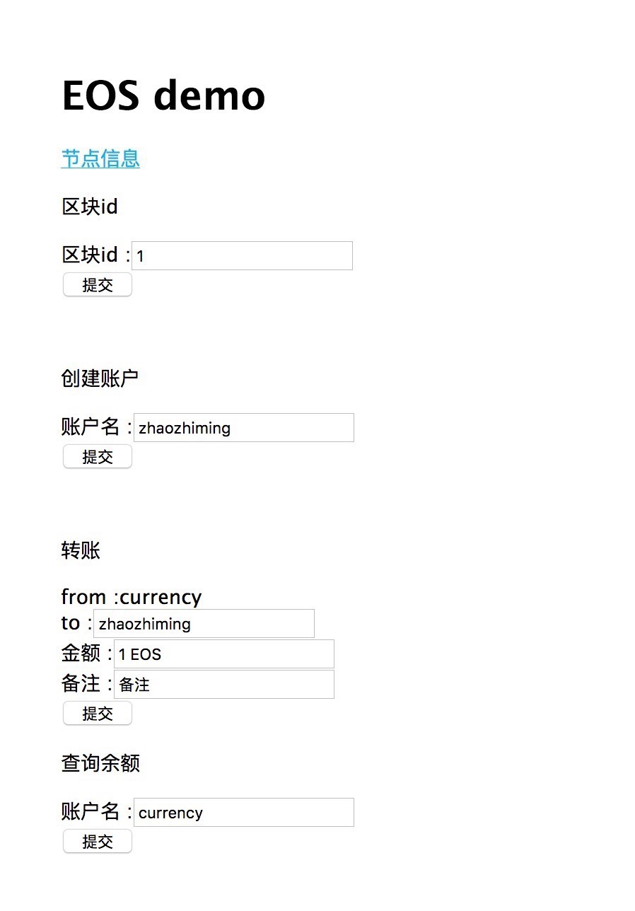

# eosjsapp
基于eos实现，功能：可以创建账户，转账，查询余额

# 使用框架
express+ejs+eosjs

##一、账户创建—>合约部署->token发行
#1、创建钱包
root@iZbp1einlbe5h87nkphdr9Z:/opt/eos/def/eosio/bin# ./cleos wallet create
Creating wallet: default
Save password to use in the future to unlock this wallet.
Without password imported keys will not be retrievable.
"PW5KFzjPTtKMgsnLaVAHxxEyt25v9tMnvCaEnW6Z5xCo3shtoQUu8"

#2、生成key
root@iZbp1einlbe5h87nkphdr9Z:/opt/eos/def/eosio/bin# ./cleos create key 
Private key: 5K5VaX7R5HYJUBFV6vxvxwZ5VXnJJQVnqKLt4vmYZPQaqqu7hcm
Public key: EOS8F2nR35cXEGvMgYnmYu83eKzNQa29XnGWyCoU1rrNNcjdQKAJE
root@iZbp1einlbe5h87nkphdr9Z:/opt/eos/def/eosio/bin# ./cleos create key 
Private key: 5J4p7RdurPoN1gK8EEmSYEDKhDgcWEt7GNP5aUMub3WUryDMF1T
Public key: EOS5ZV3aG5u6Ux9ZgYoQU6kzFaXAxPSoYZCxABhTC6c8UtmTypxKe
root@iZbp1einlbe5h87nkphdr9Z:/opt/eos/def/eosio/bin# 

#3、导入key
./cleos wallet import 5K5VaX7R5HYJUBFV6vxvxwZ5VXnJJQVnqKLt4vmYZPQaqqu7hcm

./cleos wallet import 5J4p7RdurPoN1gK8EEmSYEDKhDgcWEt7GNP5aUMub3WUryDMF1T

./cleos create account eosio currency EOS8F2nR35cXEGvMgYnmYu83eKzNQa29XnGWyCoU1rrNNcjdQKAJE EOS5ZV3aG5u6Ux9ZgYoQU6kzFaXAxPSoYZCxABhTC6c8UtmTypxKe

```
1826471ms thread-0   main.cpp:1158                 main                 ] Failed with error: Assert Exception (10)
itr != structs.end(): Unknown struct 
Failed to serialize type

```

#4、部署bios合约
./cleos set contract eosio /opt/contracts/eosio.bios -p eosio

#5、创建currency账号
    ./cleos create account eosio currency 
#6、部署代币合约
./cleos set contract currency /opt/contracts/currency


#7、创建代币    
    ./cleos push action currency create '{"issuer":"currency","maximum_supply" :"1000000.0000 CUR","can_freeze":"0","can_recall":"0","can_whitelist":"0"}' --permission currency@active
#8、发行代币
./cleos push action currency issue '{"to":"currency","quantity":"1000.0000 CUR","memo":""}' --permission currency@active
#9、转账    
./cleos push action currency transfer '{"from":"currency","to":"eosio","quantity":"20.0000 CUR","memo":"my first transfer"}' --permission currency@active
#10、查询余额
    ./cleos get table currency currency accounts


#二、eosjsapp启动

- clone https://github.com/eosDeveloper/eosjsapp.git
- 替换key成自己的key.在文件app.js里面进行替换
- eosioProductPriv, eosioProductPub在config.ini里面
- initaPrivateOwen，initaPublicOwen，initaPrivateActiv，initaPublicActiv用上面cleos生成的可以

```
var initaPrivateOwen = '5JoQioDc8gkSfSbypwSumq24nb7KyajjsDswZRaBfLUPQAtF7ks';
var	initaPublicOwen = 'EOS5uSUVNVspG2wwfPBcRx29rVs1RN9vNtVjwgFLapWn3WjYQpW6F';

var initaPrivateActiv = '5J9vX9vDtjG7iCLmah2zLUEnVnBPKifGieY8zJELJpN5G9cpdJB';
var	initaPublicActiv = 'EOS6UJqj1oBgFoe3f11TJ895WcJQhXG7DBVzjKnt4j88WkVvXTab8';

var eosioProductPriv='';
var eosioProductPub='';
```

- npm start ，默认端口80
- 如果启动失败，报类似下面错误

```
myMacBook-Pro:eosjsapp worldnese$ npm start 

> app@0.0.0 start /Users/apple/eosjsapp
> node ./bin/www

Port 80 requires elevated privileges
npm ERR! code ELIFECYCLE
npm ERR! errno 1
npm ERR! app@0.0.0 start: `node ./bin/www`
npm ERR! Exit status 1
npm ERR! 
npm ERR! Failed at the app@0.0.0 start script.
npm ERR! This is probably not a problem with npm. There is likely additional logging output above.

npm ERR! A complete log of this run can be found in:
npm ERR!     /Users/apple/.npm/_logs/2018-05-01T11_52_21_099Z-debug.log

```

- 改成：sudo npm start，原因：权限不够，改成其他端口可以不用sudo


# 端口修改
打开文件/Users/apple/eosjsapp/bin/www
```
var port = normalizePort(process.env.PORT || '80');
```
# 打开连接访问
htpp://127.0.0.0/



##四、附录：创建项目过程

#1、安装使用express
- npm install express --save
- sudo npm install -g express 
- 查看版本：express -V
- npm install -g express-generator
- 创建项目： express app
- 启动项目：npm start ，默认端口3000

#2、eosjs安装
 npm i eosjs@dawn3


# 联系方式：想加入项目一起开发可以加我微信或者发邮件
- 微信:zhiming817
- 邮箱:zhiming_817@qq.com

